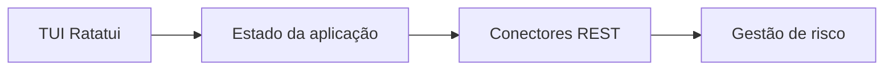

<div align="center">

# Unified Trading Super-Terminal


<p><strong>Super terminal unificado de trading</strong></p>

<p>
  <a href="https://github.com/SrSatriano/unified-trading-super-terminal"></a>
  <a href="https://srsatriano.github.io/portfolio-matheus-satriano/"></a>
</p>

<p>
  
  
  
  
  
  
</p>

<p><strong>Interface TUI estilo terminal profissional para risco, execução e carteira em um só lugar.</strong></p>

<p>
  Autor: <a href="https://github.com/SrSatriano">@SrSatriano</a> ·
  Release <strong>1.0.0</strong> (2026-03-26)
</p>

</div>

---

## Índice

1. [Visão geral](#visão-geral)
2. [Problema e solução](#problema-e-solução)
3. [Para quem é](#para-quem-é)
4. [Casos de uso](#casos-de-uso)
5. [Funcionalidades](#funcionalidades)
6. [Stack tecnológica](#stack-tecnológica)
7. [Arquitetura](#arquitetura)
8. [Estrutura do repositório](#estrutura-do-repositório)
9. [Pré-requisitos](#pré-requisitos)
10. [Instalação e execução](#instalação-e-execução)
11. [Configuração](#configuração)
12. [Testes](#testes)
13. [Performance](#performance)
14. [Deploy e operação](#deploy-e-operação)
15. [Limitações conhecidas](#limitações-conhecidas)
16. [Roadmap](#roadmap)
17. [Documentação complementar](#documentação-complementar)
18. [Segurança e licença](#segurança-e-licença)

---

## Visão geral

Este repositório faz parte do **portfólio de engenharia** mantido por [@SrSatriano](https://github.com/SrSatriano). A versão **1.0.0** entrega implementação do núcleo do produto, testes automatizados, pipeline de integração contínua e documentação operacional em **português brasileiro**.

O objetivo é permitir que você clone, execute e evolua o projeto com clareza — do desenvolvimento local ao deploy em produção.

## Problema e solução

| | |
|---|---|
| **Problema** | Múltiplas abas e plataformas dispersam atenção e atrasam decisões de risco. |
| **Solução** | TUI de baixo consumo de RAM com kill switch, métricas de exposição e conectores configuráveis. |

## Para quem é

Traders ativos, risk managers e entusiastas de Rust.

## Casos de uso

- Monitoramento 24/7 em servidor headless
- Modo somente leitura para auditoria

## Funcionalidades

- [x] Layout multi-painel com refresh ~30 FPS
- [x] Kill switch e limites de exposição
- [x] Conector mock e base para REST Binance/Bybit
- [x] Credenciais via keyring ou variáveis de ambiente
- [x] Atalhos de teclado documentados

## Stack tecnológica

| Camada | Tecnologias |
|--------|-------------|
| **Principal** | Rust, Ratatui, Tokio, REST |

## Arquitetura



Detalhamento de componentes, fluxos de dados e decisões de design: [docs/ARCHITECTURE.md](docs/ARCHITECTURE.md).

## Estrutura do repositório

| Caminho | Descrição |
|---------|-----------|
| `src/ui.rs` | Renderização Ratatui |
| `src/connectors/` | Integrações de exchange |

## Pré-requisitos

Rust 1.75+ (rustup), terminal com suporte a cores verdadeiras.

## Instalação e execução

```bash
git clone https://github.com/SrSatriano/unified-trading-super-terminal.git
cd unified-trading-super-terminal
```

```bash
cargo build --release
./target/release/uterm
```

## Configuração

| Variável | Descrição | Exemplo |
|----------|-----------|--------|
| `READ_ONLY` | Desativa envio de ordens | `true` |
| `BINANCE_API_KEY` | Chave API | `` |

> **Importante:** nunca faça commit de arquivos `.env` com segredos reais. Use `.env.example` como referência.

## Testes

Execute a suíte de testes antes de abrir pull requests:

```bash
cargo test
```

A pipeline [`.github/workflows/ci.yml`](.github/workflows/ci.yml) repete build e testes em cada push para `main`.

## Performance

| Métrica | Valor |
|---------|-------|
| RAM | < 25 MB |
| Refresh UI | 33 ms |

Metodologia, hardware de referência e flags de compilação: [docs/ARCHITECTURE.md](docs/ARCHITECTURE.md).

## Deploy e operação

| Guia | Conteúdo |
|------|----------|
| [docs/DEPLOYMENT.md](docs/DEPLOYMENT.md) | Homologação, produção e rollback |
| [docs/OPERATIONS.md](docs/OPERATIONS.md) | Monitoramento, alertas e incidentes |

## Limitações conhecidas

- Conectores ao vivo exigem chaves e testes em paper trading

## Roadmap

- Painel de ordens abertas
- Integração FIX

## Documentação complementar

| Documento | Descrição |
|-----------|-----------|
| [docs/ARCHITECTURE.md](docs/ARCHITECTURE.md) | Arquitetura e decisões técnicas |
| [docs/DEPLOYMENT.md](docs/DEPLOYMENT.md) | Deploy passo a passo |
| [docs/OPERATIONS.md](docs/OPERATIONS.md) | Runbook operacional |
| [CONTRIBUTING.md](CONTRIBUTING.md) | Como contribuir |
| [CHANGELOG.md](CHANGELOG.md) | Histórico de versões |
| [SECURITY.md](SECURITY.md) | Política de segurança |
| [AUTHORS.md](AUTHORS.md) | Créditos |

## Segurança e licença

- Dependências revisadas na release **1.0.0**
- Vulnerabilidades: siga [SECURITY.md](SECURITY.md)
- Licença: [MIT](LICENSE) © SrSatriano 2026

---

<p align="center">
  <a href="https://srsatriano.github.io/portfolio-matheus-satriano/">Portfólio completo</a> ·
  <a href="https://github.com/SrSatriano">@SrSatriano</a> ·
  <a href="https://github.com/SrSatriano/unified-trading-super-terminal">Este repositório</a>
</p>
